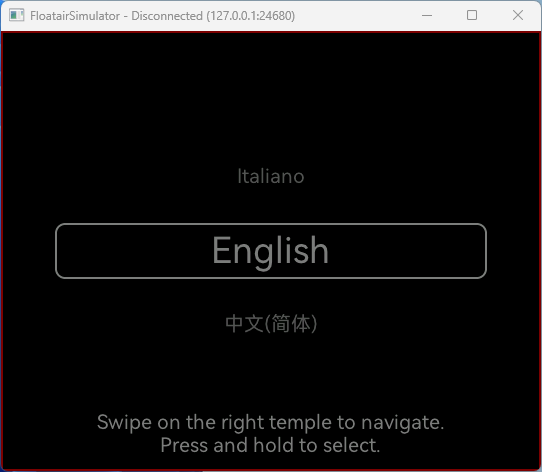
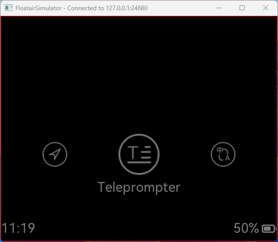
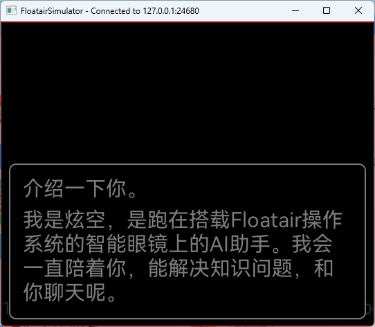
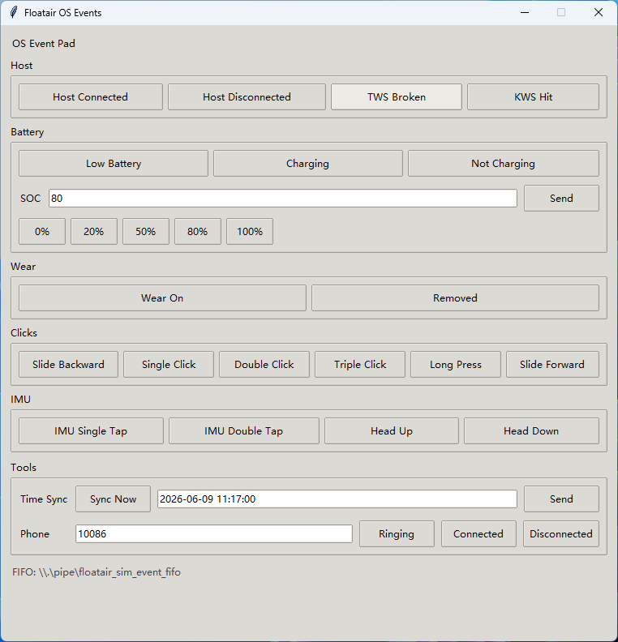
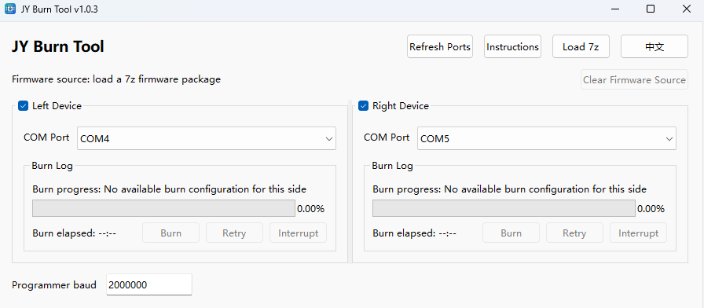

<div align="center">
  <a href="https://www.floatairos.com">
    
  </a>
  <br>
  <a href="https://www.floatairos.com">
    
  </a>

  <h1>Floatair</h1>

  <p><strong>Firmware Application Layer for JY Smart Glasses</strong></p>
  <p>Protocol Runtime · System Services · UI Infrastructure · Simulator · Firmware Delivery</p>

  <p>
    <a href="readme_cn.md">中文</a> ·
    <a href="datapath_v3_protocol.md">Protocol</a> ·
    <a href="FloatairBoard.md">Board Setup</a> ·
    <a href="FloatairSimulator.md">Desktop Simulator</a>
  </p>
</div>

## What is Floatair?

Floatair's firmware application layer connects phone-side protocols, the glasses system runtime, and LVGL UI. `jy_app` is the engineering implementation of that layer, covering business pages, system-service adapters, shared UI infrastructure, desktop simulation, ARM builds, and burn-package delivery.

## Capabilities

| Capability | Description |
| --- | --- |
| Protocol Runtime | Parse Datapath V3 app-layer messages, dispatch business commands, and send unified ACK / NACK replies |
| System Services | Handle device info, system config, runtime state, notifications, files, and popup messages |
| UI Infrastructure | Provide page framework, routing, shared widgets, status bar, toast, overlay, and roller primitives |
| Application Modules | Host Transcribe, Translate, AI, Prompter, Gallery, power on/off, and language selection pages |
| Simulator Workflow | Support desktop simulator, event panel, and ADB forwarding workflows |
| Firmware Delivery | Manage ARM firmware target, resource packaging, OS SDK cache, and `.7z` burn-package generation |

## From Development to Delivery

| Stage | Entry | Result |
| --- | --- | --- |
| Protocol integration | [datapath_v3_protocol.md](datapath_v3_protocol.md) | Host-to-glasses commands, fields, return values, and error codes |
| Page development | `apps/<app_name>/` + `common/widgets/` | Business pages, message handlers, and reusable UI interactions |
| Simulator validation | [FloatairSimulator.md](FloatairSimulator.md) | Local validation for pages, events, and integration flows |
| ARM build | `scripts/develop.sh` / `scripts/develop.bat` | Firmware app-layer ELF and resource images |
| Release packaging | `scripts/package.sh` / `scripts/package.bat` | `build/H6_APP_<tag>-<count>-g<hash>.7z` burn package |

## Preview

Floatair includes a desktop simulator for page development, state validation, and input-event debugging. The simulator covers typical glasses UI surfaces such as language selection, app entry, and AI conversation pages.

<p align="center">
  
  
  
</p>

The event pad simulates system inputs such as Host connection, battery, wear state, touch gestures, IMU events, time sync, and phone state.

<p align="center">
  
</p>

The `.7z` burn package generated by `scripts/package.*` can be loaded directly by JY Burn Tool:

- Load the `.7z` firmware package, refresh serial ports, and select the matching COM port in the left or right device panel.
- Confirm that the left and right ports are not reversed before burning; reversed ports make the glasses show `LR ERROR`.
- Use the panel log, progress bar, and `Retry` / `Interrupt` buttons to monitor or recover the flow; click `Instructions` to view the full instructions.

<p align="center">
  
</p>

## Documentation

| Document | Purpose |
| --- | --- |
| [datapath_v3_protocol.md](datapath_v3_protocol.md) | Datapath V3 protocol fields, commands, return values, and error codes |
| [FloatairBoard.md](FloatairBoard.md) | Board environment, toolchain, and build prerequisites |
| [FloatairSimulator.md](FloatairSimulator.md) | Desktop simulator build, run, ADB forwarding, and event panel debugging |

## Community

Please follow the [Code of Conduct](../CODE_OF_CONDUCT.md) when participating in issues, pull requests, and discussions. Before submitting changes, read the [Contributing Guide](../CONTRIBUTING.md).

<details>
<summary>Show detailed engineering reference</summary>

## Project Structure

| Directory / File | Description |
| --- | --- |
| `CMakeLists.txt` | Top-level build entry. It wires together platform detection, OS SDK preparation, product overlay, source collection, target creation, and target configuration. |
| `cmake/` | CMake modules for platform detection, OS SDK archive/cache handling, product overlay, common simulator settings, platform-specific options, and target build/install rules |
| `apps/` | Business app pages and their message handlers, such as Transcribe, Translate, AI, Prompter, and Gallery |
| `system/` | System status, system config, notifications, files, runtime input, popups, and system message dispatch |
| `common/` | Shared framework, message wrappers, widgets, and base adapter interfaces |
| `common/widgets/` | UI widget wrappers that page development should reuse first |
| `products/` | Product overlay. The default product is `jytek`. |
| `bes28/` | ARM firmware-side platform adapter entry |
| `simulator/FloatairSimulator/` | Desktop simulator platform adapters, build scripts, and run entry |
| `scripts/` | Filesystem image, resource generation, string pool, and release scripts |
| `lfsd/` | Writable resource directory used by the simulator and packaging flow |
| `romfs/` | Firmware read-only resource directory |
| `lvgl/` | LVGL graphics library |
| `thirdparty/` | Third-party libraries, such as `mpack`, `cJSON`, and `i18n` |
| `images/` | LVGL image resource source files |
| `StringPool.csv` | Multi-language string pool input |
| `.config` / `Kconfig` | Project configuration entry |
| `.os_sdk_cache/` | Local ignored cache for extracted OS SDK archives. Created by CMake when `JY_APP_OS_SDK_ARCHIVE` is provided. |

## Architecture Layers

### Common Layer

`common/` provides shared app-layer capabilities:

- `message.c` / `message.h` parse MsgPack application-layer messages, send ACK/NACK replies, and send data to the host channel.
- `floatair_run.c` connects application initialization and the main loop.
- `common/app_framework/` provides page, route, and app framework capabilities.
- `common/widgets/` provides button, container, image, label, message box, overlay, paged text, roller, status bar, and toast widgets.

Business pages reuse `common/widgets/` widgets and existing interaction patterns to keep page behavior and implementation boundaries consistent.

### System Layer

`system/` owns runtime capabilities and the System protocol:

- `system_msg_dispatch.c` dispatches the System protocol by `payload.biz`.
- `system_msg_devinfo.c`, `system_msg_sysconfig.c`, `system_msg_sysstatus.c`, `system_msg_syscontrol.c`, `system_msg_sysind.c`, and `system_msg_file.c` handle device information, configuration, status, control, indication, and file commands.
- `system_notification.c` handles notification add, update, and remove.
- `system_runtime_*` synchronizes input, state, UI, and miscellaneous runtime behavior.
- `system/popups/` contains system popups, such as Assistant.
- `stt_common.c` / `stt_common.h` centralize text protocol parsing used by Transcribe, Translate, AI, and Assistant.

System protocol fields are defined by the Datapath V3 protocol document.

### App Layer

Each directory under `apps/` corresponds to an app or page module. A typical module contains page implementation, message handling, resource references, and app configuration.

Common apps in the current project include:

- `home`
- `transcribe`
- `translate`
- `ai`
- `prompter`
- `gallery`
- `langselection`
- `poweron`
- `poweroff`

Other directories may host extension pages, experimental pages, or product-overlay modules.

### Platform Layer

The project supports two target families:

- `arm`: firmware app-layer target, using the `bes28/` platform adapter and ARM toolchain.
- `linux` / `macos` / `mingw` / `msvc`: desktop simulator targets, using `simulator/FloatairSimulator/` platform adapters and SDL2.

`CMakeLists.txt` uses `cmake/TargetPlatform.cmake` to detect the target platform and load the matching platform configuration.

Build modules are split by responsibility:

- `cmake/OsSdk.cmake`: resolves the OS SDK archive/cache and exposes `floatair`, `nuttx`, and `vendor` include roots.
- `cmake/ProductOverlay.cmake`: applies `JY_APP_PRODUCT`.
- `cmake/SimulatorCommon.cmake`: defines shared simulator sources, include directories, and LVGL compile definitions.
- `cmake/Platform*.cmake`: keeps platform-specific compiler, linker, SDL2, and runtime settings.
- `cmake/TargetConfig.cmake`: configures target compile/link options, post-build resource packaging, simulator install rules, and runtime DLL copying.

### Product Overlay

`JY_APP_PRODUCT` selects the product overlay. The default value is `jytek`. During CMake configuration, the overlay is cleaned first and then the selected product overlay is applied.

`JY_APP_PRODUCT=clean` only removes overlay files and cannot produce a build. Use an actual product name for builds.

## Build Overview

### ARM Firmware Target

The ARM target builds the firmware app-layer ELF and runs the resource packaging flow after build:

1. Copy `romfs/` into the build-directory staging area.
2. Run `scripts/fs_img.py`.
3. Generate littlefs images.

ARM builds require the matching firmware toolchain and configuration environment. After changing `.config` or Kconfig options, rerun the full CMake configure step.

ARM and simulator builds also consume an OS SDK archive exported from the OS repository. When calling CMake directly, pass it once with `-DJY_APP_OS_SDK_ARCHIVE=<path-to-jy_os_sdk_..._dev.7z>`. `scripts/develop.*` and the interactive simulator scripts prompt for the OS SDK archive path after product selection; press Enter to use the newest cache. CMake extracts the archive into `.os_sdk_cache/<short-sha256>/os_sdk/` and reuses that cache on later configure runs. If no archive path is provided and no valid cache exists, configuration fails with an explicit message.

Board-side convenience scripts are split by purpose:

- `scripts/develop.sh` / `scripts/develop.bat`: configure and build the ARM target.
- `scripts/package.sh` / `scripts/package.bat`: configure and build the ARM target, then package `build/nuttx_lfsc.bin`, `build/nuttx_lfsd.bin`, `build/nuttx_romfs.bin`, and repository-root `burn_plan.ini` as `build/H6_APP_<tag>-<count>-g<hash>.7z`.

When using this burn package, only the right temple needs to be flashed.

`package.*` requires 7-Zip. On Linux/macOS, `7z` or `7za` must be available in `PATH`. On Windows, the script checks `PATH` first and then the default install path `C:\Program Files\7-Zip\7z.exe`.

### Desktop Simulator Target

The simulator supports Linux, macOS, Windows MinGW, and Windows MSVC. After build, it prepares runtime resources:

1. Copy `lfsd/` to `jyt_d/` under the build directory.
2. Copy `romfs/`.
3. Run `scripts/StringPool.py` to generate multi-language JSON.
4. During install, include the simulator executable, `simulator_socket.conf`, event panel, `jyt_d/`, `romfs/`, and Windows runtime DLLs.

For simulator build, run, ADB forwarding, and event panel details, see [FloatairSimulator.md](FloatairSimulator.md).

## Protocol and Messages

Host-to-glasses application-layer messages use MsgPack. The common entry point is `app_mpack_msg_handle()`. The base structure is:

```msgpack
map(2) {
  "id": uint32,
  "payload": map(5) {
    "seq": uint32,
    "type": uint8,
    "cmd": string,
    "biz": string | nil,
    "data": map | nil
  }
}
```

The protocol selects a module by `id`. System messages are further dispatched by `payload.biz`. Success and failure replies use ACK / NACK. Complete commands, fields, return values, and error codes are documented in the Datapath V3 protocol document.

## Resources and I18n

- Image resources are mainly under `images/` and are built as LVGL-compatible C source files.
- `StringPool.csv` is the multi-language string pool input.
- Simulator builds convert the string pool into JSON under `jyt_d/system/i18n`.
- `romfs/` is used for firmware read-only resources.
- `lfsd/` is used for simulator and littlefs writable resources.

## Development Notes

1. When changing business pages, reuse widgets and existing interaction patterns from `common/widgets/` first.
2. When changing protocols, update the Datapath V3 protocol document.
3. When changing shared paths such as system message dispatch, notification, file handling, or STT text parsing, check whether `system/`, `apps/`, and phone-side protocol adaptation also need updates.
4. When changing product overlay behavior, confirm the current `JY_APP_PRODUCT` and impact scope.
5. When changing build, resources, or platform adapters, consider both ARM and simulator paths.
6. Storage resources are constrained by the miniaturized system. Plan memory allocation and storage usage carefully during development:

   | Resource | Limit | Note |
   | --- | --- | --- |
   | Process stack | < 8KB | — |
   | Available RAM | ~500KB | — |
   | Persistent storage | ~5MB | Path `/jyt_d` |

7. For build verification, use the toolchain and subproject entry that match the target platform.

## Common Entry Points

| Task | Entry |
| --- | --- |
| View protocol fields | [docs/datapath_v3_protocol.md](datapath_v3_protocol.md) |
| View board environment guide | [docs/FloatairBoard.md](FloatairBoard.md) |
| View simulator build and run guide | [docs/FloatairSimulator.md](FloatairSimulator.md) |
| Build ARM target | `scripts/develop.sh` / `scripts/develop.bat` |
| Generate ARM burn package | `scripts/package.sh` / `scripts/package.bat` |
| Change an app page | `apps/<app_name>/` |
| Change system protocol handling | `system/system_msg_*.c` |
| Change notification handling | `system/system_notification.c` |
| Change shared STT / AI text parsing | `system/stt_common.c` / `system/stt_common.h` |
| Change simulator platform adapter | `simulator/FloatairSimulator/` |

</details>
