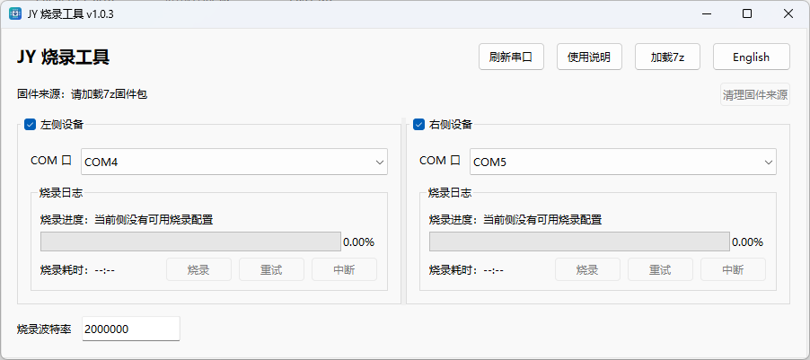

<div align="center">
  <a href="https://www.floatairos.com">
    
  </a>
  <br>
  <a href="https://www.floatairos.com">
    
  </a>

  <h1>Floatair</h1>

  <p><strong>JY 智能眼镜固件应用层</strong></p>
  <p>Protocol Runtime · System Services · UI Infrastructure · Simulator · Firmware Delivery</p>

  <p>
    <a href="readme.md">English</a> ·
    <a href="datapath_v3_protocol_cn.md">协议文档</a> ·
    <a href="FloatairBoard_cn.md">板端环境</a> ·
    <a href="FloatairSimulator_cn.md">桌面模拟器</a>
  </p>
</div>

## Floatair 是什么

Floatair 的固件应用层连接手机端协议、眼镜端系统运行时和 LVGL UI。`jy_app` 是这一层的工程实现，覆盖业务页面、系统服务适配、公共 UI 基础设施、桌面模拟验证、ARM 构建和烧录包交付。

## 核心能力

| 能力 | 说明 |
| --- | --- |
| Protocol Runtime | 解析 Datapath V3 应用层报文，分发业务命令，并统一 ACK / NACK 回包 |
| System Services | 处理设备信息、系统配置、运行时状态、通知、文件和 popup 等系统消息 |
| UI Infrastructure | 提供页面框架、路由、公共控件、状态栏、toast、overlay 和 roller 等 UI 基础能力 |
| Application Modules | 承载转写、翻译、AI、提词器、图库、开关机和语言选择等业务页面 |
| Simulator Workflow | 支持桌面模拟器、事件面板和 ADB 转发联调 |
| Firmware Delivery | 管理 ARM 固件目标、资源打包、OS SDK 缓存和 `.7z` 烧录包生成 |

## 从开发到交付

| 阶段 | 入口 | 结果 |
| --- | --- | --- |
| 协议对接 | [datapath_v3_protocol_cn.md](datapath_v3_protocol_cn.md) | 明确 Host 到眼镜端的命令、字段、返回值和错误码 |
| 页面开发 | `apps/<app_name>/` + `common/widgets/` | 实现业务页面、消息处理和可复用 UI 交互 |
| 模拟验证 | [FloatairSimulator_cn.md](FloatairSimulator_cn.md) | 在本地模拟器中验证页面、事件和联调链路 |
| ARM 构建 | `scripts/develop.sh` / `scripts/develop.bat` | 生成固件 app 层 ELF 和资源镜像 |
| 交付打包 | `scripts/package.sh` / `scripts/package.bat` | 生成 `build/H6_APP_<tag>-<count>-g<hash>.7z` 烧录包 |

## 视觉预览

Floatair 提供桌面模拟器用于页面开发、状态验证和输入事件联调。模拟器界面覆盖语言选择、首页应用入口、AI 对话等典型眼镜端页面。

<p align="center">
  
  
  
</p>

事件面板用于模拟 Host 连接、电量、佩戴状态、触控、IMU、时间同步和电话状态等系统输入。

<p align="center">
  
</p>

`scripts/package.*` 生成的 `.7z` 烧录包可直接交给 JY 烧录工具使用：

- 加载 `.7z` 固件包，刷新串口，并在左侧设备 / 右侧设备面板中选择对应 COM 口。
- 烧录前必须确认左右串口没有选反；选反会导致眼镜显示 `LR ERROR`。
- 通过面板日志、进度条和 `重试` / `中断` 按钮处理烧录过程；点击 `使用说明` 查看完整说明。

<p align="center">
  
</p>

## 文档

| 文档 | 用途 |
| --- | --- |
| [datapath_v3_protocol_cn.md](datapath_v3_protocol_cn.md) | Datapath V3 协议字段、命令、返回值和错误码 |
| [FloatairBoard_cn.md](FloatairBoard_cn.md) | 板端环境准备、工具链和构建前置条件 |
| [FloatairSimulator_cn.md](FloatairSimulator_cn.md) | 桌面模拟器构建、运行、ADB 转发和事件面板联调 |

## 社区

参与 issue、PR 和讨论时，请遵守 [行为准则](../CODE_OF_CONDUCT.md)。提交修改前，可以先阅读 [贡献指南](../CONTRIBUTING.md)。

<details>
<summary>展开详细工程说明</summary>

## 工程结构

| 目录 / 文件 | 说明 |
| --- | --- |
| `CMakeLists.txt` | 工程总构建入口，负责串联目标平台识别、OS SDK 准备、产品 overlay、源码收集、target 创建和 target 配置 |
| `cmake/` | 平台识别、OS SDK 包/缓存处理、产品 overlay、模拟器公共配置、平台差异配置和 target 构建/安装规则 |
| `apps/` | 业务应用页面和对应消息处理，例如转写、翻译、AI、提词器、图库等 |
| `system/` | 系统状态、系统配置、通知、文件、运行时输入、popup 和系统消息分发 |
| `common/` | 公共框架、消息封装、公共控件和基础适配接口 |
| `common/widgets/` | 页面开发优先复用的 UI 控件封装 |
| `products/` | 产品 overlay，默认使用 `jytek` |
| `bes28/` | ARM 固件侧平台适配入口 |
| `simulator/FloatairSimulator/` | 桌面模拟器平台适配、构建脚本和运行入口 |
| `scripts/` | 文件系统镜像、资源生成、字符串池、发布等脚本 |
| `lfsd/` | 模拟器和打包流程使用的可写资源目录 |
| `romfs/` | 固件只读资源目录 |
| `lvgl/` | LVGL 图形库 |
| `thirdparty/` | 第三方库，例如 `mpack`、`cJSON`、`i18n` |
| `images/` | LVGL 图片资源源码 |
| `StringPool.csv` | 多语言字符串池输入 |
| `.config` / `Kconfig` | 工程配置入口 |
| `.os_sdk_cache/` | 本地忽略的 OS SDK 解压缓存；传入 `JY_APP_OS_SDK_ARCHIVE` 时由 CMake 创建 |

## 架构分层

### 公共层

`common/` 提供 app 层共用能力：

- `message.c` / `message.h` 负责 MsgPack 应用层报文解析、ACK/NACK 回包和 host 通道发送。
- `floatair_run.c` 负责应用初始化和主循环衔接。
- `common/app_framework/` 提供页面、路由和应用框架能力。
- `common/widgets/` 提供按钮、容器、图片、标签、弹窗、overlay、paged text、roller、状态栏、toast 等控件封装。

业务页面复用 `common/widgets/` 的控件和交互模式，以保持页面体验和实现边界一致。

### 系统层

`system/` 负责设备运行时能力和 system 协议：

- `system_msg_dispatch.c` 按 `payload.biz` 分发 System 协议。
- `system_msg_devinfo.c`、`system_msg_sysconfig.c`、`system_msg_sysstatus.c`、`system_msg_syscontrol.c`、`system_msg_sysind.c`、`system_msg_file.c` 分别处理设备信息、配置、状态、控制、指示和文件命令。
- `system_notification.c` 处理通知添加、更新和移除。
- `system_runtime_*` 负责输入、状态、UI 和杂项运行时同步。
- `system/popups/` 放系统 popup，例如 assistant。
- `stt_common.c` / `stt_common.h` 收敛转写、翻译、AI 和 assistant 使用的文本协议解析。

System 协议字段由 Datapath V3 协议文档统一定义。

### 应用层

`apps/` 下每个目录对应一个应用或页面模块。典型模块由页面实现、消息处理、资源引用和应用配置组成。

当前工程里常见应用包括：

- `home`
- `transcribe`
- `translate`
- `ai`
- `prompter`
- `gallery`
- `langselection`
- `poweron`
- `poweroff`

其它目录用于承载扩展页面、实验页面或产品 overlay 相关模块。

### 平台层

工程支持两类目标：

- `arm`：固件 app 层目标，使用 `bes28/` 平台适配和 ARM 工具链。
- `linux` / `macos` / `mingw` / `msvc`：桌面模拟器目标，使用 `simulator/FloatairSimulator/` 平台适配和 SDL2。

`CMakeLists.txt` 通过 `cmake/TargetPlatform.cmake` 识别目标平台，并加载对应平台配置。

CMake 模块按职责拆分：

- `cmake/OsSdk.cmake`：解析 OS SDK 7z 包或本地缓存，并导出 `floatair`、`nuttx`、`vendor` include 根目录。
- `cmake/ProductOverlay.cmake`：应用 `JY_APP_PRODUCT`。
- `cmake/SimulatorCommon.cmake`：定义模拟器公共源文件、include 目录和 LVGL 编译宏。
- `cmake/Platform*.cmake`：保留各平台自己的编译器、链接器、SDL2 和运行时配置。
- `cmake/TargetConfig.cmake`：配置 target 编译/链接选项、构建后资源处理、模拟器安装规则和运行时 DLL 拷贝。

### 产品 overlay

`JY_APP_PRODUCT` 用于选择产品 overlay，默认值为 `jytek`。CMake 配置阶段会先执行 overlay 清理，再应用对应产品目录。

如果只是清理 overlay，不能直接用 `JY_APP_PRODUCT=clean` 产出构建；需要选择实际产品名。

## 构建概览

### ARM 固件目标

ARM 目标会构建固件 app 层 ELF，并在构建后执行资源打包流程：

1. 复制 `romfs/` 到构建目录 staging。
2. 调用 `scripts/fs_img.py`。
3. 生成 littlefs 相关镜像。

涉及 ARM 构建时，需要使用对应固件工具链和配置环境。修改 `.config` 或 Kconfig 配置后，需要重新执行完整 CMake 配置流程。

ARM 和模拟器构建都需要使用 OS 仓导出的 OS SDK 包。直接调用 CMake 时，首次配置传入 `-DJY_APP_OS_SDK_ARCHIVE=<path-to-jy_os_sdk_..._dev.7z>`；`scripts/develop.*` 和模拟器交互脚本会在选择产品后提示输入 OS SDK 包路径，直接回车则使用最新缓存。CMake 会解压到 `.os_sdk_cache/<short-sha256>/os_sdk/` 并在后续配置中复用；如果既没有传入包路径，也没有有效缓存，会直接报错。

板端常用脚本分为开发构建和烧录包打包两类：

- `scripts/develop.sh` / `scripts/develop.bat`：配置并构建 ARM 目标。
- `scripts/package.sh` / `scripts/package.bat`：配置并构建 ARM 目标，成功后把 `build/nuttx_lfsc.bin`、`build/nuttx_lfsd.bin`、`build/nuttx_romfs.bin` 和仓库根目录 `burn_plan.ini` 打成 `build/H6_APP_<tag>-<count>-g<hash>.7z`。

使用该烧录包时只需要烧录右腿。

`package.*` 依赖 7-Zip：Linux/macOS 需要 `7z` 或 `7za` 在 `PATH` 中；Windows 会优先查找 `PATH`，再尝试默认安装路径 `C:\Program Files\7-Zip\7z.exe`。

### 桌面模拟器目标

模拟器支持 Linux、macOS、Windows MinGW 和 Windows MSVC。构建后会准备运行时资源：

1. 复制 `lfsd/` 到构建目录的 `jyt_d/`。
2. 复制 `romfs/`。
3. 调用 `scripts/StringPool.py` 生成多语言 JSON。
4. 安装时带上模拟器可执行文件、`simulator_socket.conf`、事件面板、`jyt_d/`、`romfs/` 和 Windows 运行时 DLL。

模拟器详细构建、运行、ADB 转发和事件面板说明请看 [FloatairSimulator_cn.md](FloatairSimulator_cn.md)。

## 协议与消息

Host 到眼镜端的应用层报文使用 MsgPack，公共入口是 `app_mpack_msg_handle()`。基础结构为：

```msgpack
map(2) {
  "id": uint32,
  "payload": map(5) {
    "seq": uint32,
    "type": uint8,
    "cmd": string,
    "biz": string | nil,
    "data": map | nil
  }
}
```

协议按 `id` 选择模块，System 再按 `payload.biz` 二级分发。成功和失败回包统一使用 ACK / NACK。完整命令、字段、返回值和错误码请看 Datapath V3 协议文档。

## 资源与国际化

- 图片资源主要放在 `images/`，以 LVGL 可用的 C 源码形式参与构建。
- `StringPool.csv` 是多语言字符串池输入。
- 模拟器构建会把字符串池转换成 JSON 并放入 `jyt_d/system/i18n`。
- `romfs/` 用于固件只读资源。
- `lfsd/` 用于模拟器和 littlefs 可写资源。

## 开发建议

1. 修改业务页面时，优先复用 `common/widgets/` 的控件和已有交互模式。
2. 修改协议时，同步更新 Datapath V3 协议文档。
3. 修改系统消息分发、通知、文件、STT 文本等公共路径时，检查 `system/`、`apps/` 和手机端协议适配是否都需要同步。
4. 修改产品 overlay 时，确认当前 `JY_APP_PRODUCT` 和影响范围。
5. 修改构建、资源或平台适配时，分别考虑 ARM 和模拟器路径。
6. 存储资源受限于系统小型化约束，开发时需合理规划内存分配与存储使用：

   | 资源 | 限制 | 备注 |
   | --- | --- | --- |
   | 进程栈空间 | < 8KB | — |
   | 可用 RAM | ~500KB | — |
   | 持久化存储 | ~5MB | 路径 `/jyt_d` |

7. 构建验证按目标平台选择对应工具链和子工程入口。

## 常用入口

| 任务 | 入口 |
| --- | --- |
| 查看协议字段 | [docs/datapath_v3_protocol_cn.md](datapath_v3_protocol_cn.md) |
| 查看板端环境准备 | [docs/FloatairBoard_cn.md](FloatairBoard_cn.md) |
| 查看模拟器构建和运行 | [docs/FloatairSimulator_cn.md](FloatairSimulator_cn.md) |
| 构建 ARM 目标 | `scripts/develop.sh` / `scripts/develop.bat` |
| 生成 ARM 烧录包 | `scripts/package.sh` / `scripts/package.bat` |
| 修改应用页面 | `apps/<app_name>/` |
| 修改系统协议处理 | `system/system_msg_*.c` |
| 修改通知处理 | `system/system_notification.c` |
| 修改 STT / AI 文本公共解析 | `system/stt_common.c` / `system/stt_common.h` |
| 修改模拟器平台适配 | `simulator/FloatairSimulator/` |

</details>
